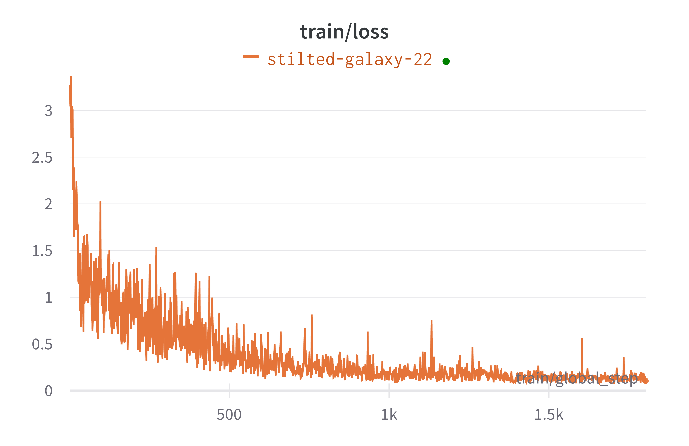

# RIS Domain Specific LLM

This repository contains code for accessing a RIS Domain Specific LLM based off of [Alpaca-LoRA](https://github.com/tloen/alpaca-lora/). We provide the documentation of the training process with user specific data.

In addition to the training code, we publish a script for generating permutations of instructional prompts.

To visualize data, we use [Weights and Balances](wandb.ai).

### Setup

1. As a prerequisite, it is assumed that users will have access to [RIS Compute Services](https://ris.wustl.edu/).

1. After logging in to Compute, open tmux, which will allow us to continue running jobs in the background, useful for model training.

   ```bash
   tmux
   ```

1. Change the working directory, this will allow for more storage than the $HOME directory, as the directory will be attached via LSF docker volume:
    ```bash
   cd /tmp
   ```
1. Submit the following job to LSF:
    ```bash
   LSF_DOCKER_VOLUMES="/scratch1/fs1/sleong:$HOME \
    /scratch1/fs1/sleong/flagged:/workspace/flagged \
    " LSF_DOCKER_ENTRYPOINT=/bin/bash LSF_DOCKER_NETWORK=host LSF_DOCKER_IPC=host LSF_DOCKER_SHM_SIZE=64G bsub < ~/llm.bsub
   ```
1. Make note of the job id of the previous job. Submit the following job to go into the container: 
    ```bash
    bsub -Is -q general -a "docker_exec($put_job_id_here)" -G compute-sleong -R 'gpuhost' -gpu "" /bin/bash
   ```
1. Change the terminal type to xterm to fix key bindings:
    ```bash
   export TERM=xterm
   ```
1. Change the directory to the model directory
    ```bash
    cd ~/llm
   ```
1. Run the python script to load model:
    ```bash
    python3.10 generate.py
   ```
1. Start local Django project by activating the virtual environment, change the working directory to the location of the Django project, and starting the server:
    ```bash
    source openai/bin/activate
    cd ./chatbot
    python manage.py runserver
   ```

### Training (`ris-llm.py`)

This file contains the code for training the model. 

Example usage:

Change instruction path:

```bash
file = open("ris_data.json", "r")
```

```bash
python3.10 ris-llm.py
```

We can also tweak our hyperparameters:

```bash
# training hyperparams
    batch_size: int = 2,
    micro_batch_size: int = 1,
    num_epochs: int = 4,
    learning_rate: float = 3e-4,
    cutoff_len: int = 512,
    val_set_size: int = 10,
```

For more information on training details, see [TRAINING.md](TRAINING.md)

### Inference (`generate.py`)

This file reads the foundation model from the Hugging Face model hub and the LoRA weights from `tloen/alpaca-lora-7b`, and runs a Gradio interface for inference on a specified input. Users should treat this as example code for the use of the model, and modify it as needed.

### Final Results

The most recent model was trained on 1000 instructions, with 200 unique inputs. Training took 44 minutes in total.

Visualized below is the loss function during training (lower is better): 



By comparing the loss value at the start and end of training (3.114, 0.1054), we found that the model has improved by 29.94x. 

And below is the loss function calculated on a validation set, after each training iteration:

(pic here, need to set eval step to lower so more data points taken)

Overall, train/loss will continually decrease, while eval/loss may start to increase after a point, which indicates overfitting, where the model will begin to perform worse on new data. So in essence, training loss evaluates model performance on train data, while validation loss evaluates ability to generalize.

#### Limitations

1.  We can improve our model performance if we had a better dataset with more instructions. 
2. Instructions requiring mathematical computations result in less accurate / correct responses

### Example outputs
Visit the Alpaca-LoRA [public demo](https://huggingface.co/spaces/tloen/alpaca-lora) for the base model.

**Instruction**: Tell me about RIS.

**Alpaca-LoRA**: RIS is an acronym for Remote Intelligent Surveillance. It is a type of surveillance system that uses remote sensors to detect and monitor activities in a given area. RIS systems can be used for a variety of applications, such as security, environmental monitoring, and healthcare.

**RIS Trained**: RIS is the Research Infrastructure Services team within WashU IT.

---

**Instruction**: How do I pause specific jobs from a job array in RIS Compute?

**Alpaca-LoRA**: To pause specific jobs from a job array in RIS Compute, you can use the pause() function. For example, if you want to pause job 1, you can use pause(1).

**RIS Trained**: To stop jobs 10, 20 and 55-65 from the job array named blast_array with ID 456: bstop 'my_array[10, 20, 55-65]'

---

**Instruction**: Are RIS Compute users limited in terms of GPU usage?

**Alpaca-LoRA**: No, RIS Compute users are not limited in terms of GPU usage.

**RIS Trained**: We provide services for the entire WashU campus and as such, we suggest a best practices of not over allocating how many resources a single user utilizes. To that point, we suggest that a single user take up no more than 10 GPUs at a time.

---

**Instruction**: What are the current CPU architectures available for RIS Compute?.

**Alpaca-LoRA**: The current CPU architectures available for RIS Compute are x86, x64, ARM, PowerPC, and MIPS.

**RIS Trained**: Current CPU architecture available in the general host group: Intel_Xeon_Gold6242CPU280GHz, Intel_Xeon_Gold6148CPU240GHz

---

**Instruction**: Why am I geting a Disk I/O error on RIS?

**Alpaca-LoRA**: You may be getting a Disk I/O error on RIS if there is not enough free space on the hard drive or if the hard drive is damaged.

**RIS Trained**: This error typically refers to the ability of the job to write a file to a directory. The most common source of the error is a user’s home directory being full. If you encounter this error, please follow the steps below: Use the methods described in the home directory space section section to determine if the home directory is at cap. Remove or move files from the home directory to reduce usage. Attempt to run the job again. If the problem persists, submit a ticket to the service desk: https://ris.wustl.edu/support/service-desk/

